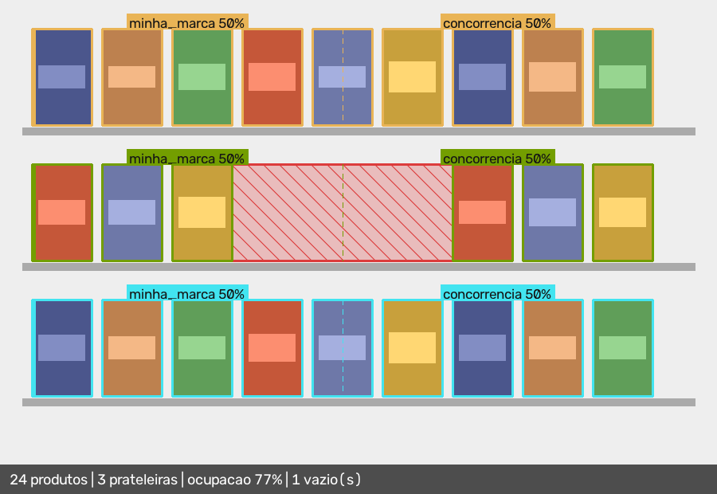

# Vitrine

**Auditoria de execução em ponto de venda por visão computacional.**



```
                         Share por prateleira
┌───────┬──────────┬──────────┬────────┬──────────────┬──────────────┐
│       │          │          │        │  minha_marca │ concorrencia │
│ Prat. │ Produtos │ Ocupacao │ Vazios │ cont. | area │ cont. | area │
├───────┼──────────┼──────────┼────────┼──────────────┼──────────────┤
│     0 │        9 │      87% │      0 │    44% | 50% │    56% | 50% │
│     1 │        6 │      58% │      1 │    50% | 50% │    50% | 50% │
│     2 │        9 │      87% │      0 │    44% | 50% │    56% | 50% │
└───────┴──────────┴──────────┴────────┴──────────────┴──────────────┘
24 produtos em 3 prateleira(s); 1 vazio(s).
```

> Saída real de `vitrine analyze`, sobre a imagem acima. Reproduza com
> `uv run python examples/demo.py`.

> **Status: Fase 2 de 4.** Funciona de ponta a ponta — foto entra, relatório e
> imagem anotada saem. **O detector real ainda não tem peso treinado em
> gôndola**, e as métricas de detecção continuam *não medidas*. Ver
> [Resultados](#resultados) e [O que ainda não existe](#o-que-ainda-não-existe).

---

## O problema

Trabalho como promotor de merchandising. A rotina é essa: chego na loja com uma
prancheta, conto quantos produtos meus estão na gôndola, anoto se tem espaço
vazio, tiro uma foto, mando no grupo do WhatsApp e alguém joga aquilo numa
planilha no fim do dia. Na loja seguinte, tudo de novo.

A indústria de bens de consumo paga — em dinheiro, em bonificação, em acordo
comercial — para que seus produtos ocupem um determinado espaço de prateleira. E
não tem como verificar se aquele espaço está sendo ocupado. A informação existe:
está na foto que eu tirei. Só que ela morre ali, como imagem, sem virar número.
Quando vira número, vira o número que eu digitei na prancheta, que ninguém
consegue auditar depois.

Este projeto pega a foto e devolve o número. Quantos produtos estão expostos,
como o espaço está dividido, onde tem buraco na prateleira. O problema não é
hipotético e o sistema não é uma demo: é a ferramenta que eu queria ter.

---

## Por que não tem interface web

Porque a interface não é o difícil aqui, e fingir que é seria desonesto.

Este projeto **não tem front-end, não tem API HTTP e não tem Docker Compose com
cinco serviços**. É decisão de arquitetura, não limitação. A saída visual é a
imagem anotada — ela *é* a UI, e é a primeira coisa neste README. A integração
com qualquer outro sistema se faz pelo `--json`, com schema versionado — ele *é*
a API:

```bash
vitrine analyze foto.jpg --json | jq '.regions[] | {(.region): .linear_share}'
```

Uma camada web em cima disso adicionaria superfície de manutenção sem adicionar
capacidade. O efeito colateral é o ponto: sem tela bonita, não há onde esconder
problema. A qualidade do código, dos testes e do contrato de saída é o produto
inteiro.

---

## O que faz e o que não faz

**Faz, funcionando e testado:**

- Carrega a foto corrigindo **orientação EXIF** e reduzindo o tamanho, com o
  fator registrado na saída.
- Corrige **perspectiva** a partir de quatro cantos informados.
- Detecta produtos por trás de um **protocolo**, com três implementações
  (`fake`, `contour`, `yolo`) — trocáveis sem tocar em nenhuma regra de negócio.
- Remove **detecções duplicadas** antes de contar.
- Agrupa em **prateleiras**, com limiar relativo ao tamanho do produto.
- Calcula **share por contagem**, **share por área linear** e **ocupação**, lado
  a lado.
- Detecta **espaço vazio** com limiar relativo à largura mediana da prateleira.
- Desenha a **imagem anotada** e emite **JSON com schema versionado**.
- Mede **precisão, recall e AP@50** de qualquer detector sobre um dataset
  anotado.

**Não faz, e não vai fazer:**

- **Não identifica SKU nem marca.** Produto é classe única. Sem isso, "share of
  shelf" só faz sentido entre *regiões espaciais* da gôndola, e é assim que ele
  é calculado.
- **Não detecta prateleira vazia.** O sistema infere prateleiras a partir dos
  produtos. Onde não há produto, não há prateleira, e portanto não há alerta.
  Ruptura total de uma prateleira inteira é um ponto cego real deste método.
- **Não detecta a gôndola automaticamente.** Os quatro pontos da perspectiva são
  informados à mão. Detecção automática é um projeto inteiro sozinho e entra só
  se for medido que ajuda.
- **Não tem interface web.** Ver acima.

---

## Como funciona

```
foto.jpg
   │
   ├─ image ............. carrega, corrige EXIF, reduz  ─┐
   │                                                     │ vision
   ├─ perspective ....... homografia por 4 pontos        │ (sabe o que é imagem)
   │                                                     │
   ├─ Detector (Protocol)  fake | contour | yolo        ─┘
   │        │
   │        └─ detecções (caixas)
   │
   ├─ dedup ............. remove a mesma garrafa contada três vezes  ─┐
   ├─ shelves ........... agrupa em prateleiras (clusterização 1D)    │ domain
   ├─ share ............. contagem, área linear e ocupação por região │ (só matemática)
   └─ gaps .............. espaços onde caberia produto               ─┘
            │
            ├─ ShareReport ──► JSON (schema 1.1)
            └─ annotate ────► imagem anotada
```

**A regra de dependência é rígida:** `domain/` não importa nada de `vision/`,
`render/` ou `eval/`, e não conhece imagem, arquivo nem modelo. Não é uma
promessa do README — é [um teste](tests/unit/test_architecture.py) que analisa a
AST de cada módulo e quebra a suíte se alguém violar.

### As decisões que importam

**1. O modelo é injetado, nunca importado pela lógica.** Existe um `Detector`
Protocol; `YoloDetector` é uma implementação entre outras. Consequência prática:
**toda a suíte rápida roda sem carregar um único peso** — 279 testes em cerca de
5 segundos, incluindo o caminho completo de foto até imagem anotada. E o
Ultralytics é um *extra opcional*, não uma dependência base: `pipx install
vitrine-shelf` não baixa gigabytes de torch. Se o modelo estivesse em
`dependencies`, a injeção seria decoração.

**2. Agrupamento em prateleiras.** Prateleira é inferência, não dado.
Clusterização aglomerativa 1D por *single linkage* sobre o centro vertical, com
limiar `τ = 0.5 × mediana(altura dos produtos)` — relativo, nunca absoluto em
pixels, porque um limiar em pixels quebra assim que a resolução muda.

Descartei k-means (exige saber quantas prateleiras existem, que é justamente o
que não se sabe), DBSCAN (em 1D degenera para o mesmo algoritmo, com dois
hiperparâmetros a mais e uma dependência externa) e histograma com detecção de
picos (depende do tamanho do bin, e bin é uma constante em pixels).

Single linkage puro sofre de *chaining*: uma escada de produtos com centros
deslizando de pouco em pouco — o que acontece em toda gôndola fotografada em
ângulo — funde duas prateleiras num cluster só, silenciosamente. Por isso todo
cluster com dispersão vertical acima de `1.5 × mediana(altura)` é reparticionado
na sua maior lacuna interna. Onde o método quebra está documentado em
[`shelves.py`](src/vitrine/domain/shelves.py), e o relatório sinaliza via
`spread_ratio` e um aviso.

**3. Share of shelf tem duas definições, e elas discordam.** Share por contagem
e share por área linear não dão o mesmo número — e chegam a inverter a ordem
entre regiões. Duas embalagens grandes contra três pequenas: por contagem, as
pequenas ganham; por área, as grandes. As duas leituras são legítimas e
respondem a perguntas diferentes. Publicar só uma seria escolher a resposta mais
conveniente, então o relatório traz as duas — repare nas colunas `cont. | area`
da tabela no topo.

O share linear sai da **união** das projeções horizontais, nunca da soma das
larguras: em gôndola cheia os produtos se sobrepõem na projeção 2D, e a soma
ingênua daria share acima de 100%.

**4. O denominador do share é uma decisão, não um dado.** `ocupado / total`
exige dizer o que é `total`, e a prateleira física não é detectada. Duas
escolhas defensáveis, com números diferentes: `envelope` (do primeiro ao último
produto — ignora vazio nas pontas) e `explicit` (`--extent`, informado por quem
conhece a gôndola). O relatório **sempre** carrega qual foi usado.

**5. Espaço vazio é relativo.** Vazio não é ausência de caixa — entre dois
produtos sempre sobram pixels. Vazio é um intervalo onde caberia mais um produto
*daquela prateleira*. O limiar é a largura mediana local: uma prateleira de latas
e uma de caixas de sabão em pó têm noções diferentes de "grande".

**6. A perspectiva é aplicada à imagem, antes da detecção.** Transformar caixas
por homografia produziria quadriláteros, e o domínio só entende retângulo
alinhado ao eixo — além de o detector acertar mais em imagem retificada.

**7. EXIF é corrigido sempre.** Foto de celular vem rotacionada por metadado.
Orientação errada entrega a gôndola deitada, e o agrupamento por centro vertical
produz lixo **sem levantar erro nenhum**. É a falha silenciosa mais cara do
sistema e tem [teste próprio](tests/unit/test_vision.py).

---

## O contrato de saída

Recorte do JSON real gerado pela imagem no topo:

```json
{
  "schema_version": "1.1",
  "status": "ok",
  "total_detections": 24,
  "shelf_count": 3,
  "image":    { "name": "gondola.png", "width": 900, "height": 620,
                "exif_rotated": false, "downscale": 1.0, "rectified": false },
  "detector": { "name": "contour", "version": "opencv-5.0.0",
                "weights": null, "weights_sha256": null },
  "regions": [
    { "region": "minha_marca",  "count": 11, "count_share": 0.4583,
      "occupied_length": 900.0, "linear_share": 0.5, "occupancy": 0.7702 },
    { "region": "concorrencia", "count": 13, "count_share": 0.5417,
      "occupied_length": 900.0, "linear_share": 0.5, "occupancy": 0.7702 }
  ]
}
```

Todo relatório carrega `image`, `detector` e `params` — a procedência completa.
Comparar duas visitas ao mesmo PDV só significa alguma coisa se o peso, os
limiares e o tratamento da imagem forem os mesmos, e esses campos existem para
que isso seja verificável em vez de suposto.

`occupancy` não é share e não soma 1,0 — é ocupado dividido pela largura da
região. É a única das três métricas afirmável sem definir regiões, e por isso é
o que o relatório traz por padrão.

---

## Resultados

**Precisão, recall e mAP@50 sobre o SKU-110K: não medido.**

O motivo não é falta de código — a máquina de medição existe, está testada e
roda. O que falta é o peso: **não existe checkpoint YOLO oficial pré-treinado em
SKU-110K**. O Ultralytics distribui um `SKU-110K.yaml` (configuração de
*dataset*, para treinar) e pesos de COCO, que não conhecem gôndola. As opções e
o método já registrado estão em [`benchmarks/results.md`](benchmarks/results.md).

O que **está** medido, de execução real em 2026-08-31:

| Métrica | Valor |
|---|---|
| Testes da suíte rápida | 279 passando, 1 pulado |
| Tempo da suíte rápida | ~5 s (ver ressalva) |
| Cobertura de `vitrine.domain` | **100%** de linhas e de ramos |
| Cobertura do pacote inteiro | 92% de linhas |
| Invariantes de propriedade | 18 propriedades × 500 exemplos |
| Avaliador sobre conjunto sintético | precisão 1.0, recall 1.0, AP@0.5 1.0 |

A última linha **não é um resultado de detecção**: é a verificação de que o
instrumento marca zero corretamente antes de medir qualquer coisa.

---

## Como rodar

```bash
uv sync
uv run vitrine analyze foto.jpg --out ./resultado
```

Com o detector real (baixa torch, alguns gigabytes):

```bash
uv pip install 'vitrine-shelf[yolo]'
uv run vitrine analyze foto.jpg --detector yolo --out ./resultado
```

Exemplo completo — perspectiva corrigida e o espaço contratado da metade para a
direita:

```bash
uv run vitrine analyze foto.jpg --out ./resultado --detector yolo --perspective 120,80 900,60 940,700 100,720 --cuts 0,0.5,1 --region-names minha_marca,concorrencia
```

Avaliar um detector sobre um dataset anotado no formato YOLO:

```bash
uv run vitrine benchmark ./dataset --split val --detector yolo --weights modelo.pt --json
```

Como biblioteca:

```python
from pathlib import Path
from vitrine import ContourDetector, RegionSet, analyze_image, annotate

resultado = analyze_image(
    Path("foto.jpg"),
    ContourDetector(invert=True),
    regions=RegionSet.from_cuts((0.0, 0.5, 1.0), ("minha_marca", "concorrencia")),
)
print(resultado.report.model_dump_json(indent=2))
```

`analyze_image` aceita **qualquer** objeto que satisfaça o protocolo `Detector`
— inclusive o seu.

### Convenções da CLI

- **stdout** carrega o resultado (tabela ou `--json`); **stderr** carrega erros e
  avisos. Por isso `--json | jq` funciona e a barra de progresso não contamina o
  pipe.
- Exit codes: `0` sucesso, `1` erro de uso, `2` falha de processamento.
- Toda mensagem de erro traz uma dica do que fazer. O stack trace nunca aparece
  para o usuário — vai para `--log-file`, e a mensagem diz onde.

---

## Testes

```bash
uv run pytest                                              # suíte rápida, sem modelo
uv run pytest -m slow                                      # exige o extra [yolo]
HYPOTHESIS_PROFILE=thorough uv run pytest tests/property   # 500 exemplos por propriedade
uv run pytest --cov=vitrine --cov-report=term-missing
uv run mypy src/ tests/ && uv run ruff check . && uv run ruff format --check .
```

Nenhuma imagem versionada nos testes: as fixtures são geradas em runtime, e o
resultado esperado sai de uma conta, não de conferência visual. O
`ContourDetector` recupera os retângulos sintéticos **pixel a pixel**, o que
torna os testes de ponta a ponta verificações exatas em vez de aproximações.

### As invariantes

Um exemplo escrito à mão prova que uma conta está certa. Uma invariante prova
que ela continua certa para entradas que ninguém pensou em escrever.

| | Invariante |
|---|---|
| P1 | A soma dos shares vale 1,0 — por contagem e por área, no total e em cada prateleira |
| P2 | Reordenar as detecções de entrada não muda um byte da saída |
| P3 | Escalar todas as coordenadas não muda proporção alguma |
| P4 | Transladar a foto inteira não muda nada — pega o bug de comparar coordenada absoluta com limiar |
| P5 | O agrupamento é uma partição total: nada se perde, nada se duplica, cada detecção cai em exatamente uma região |
| P6 | Com caixas sobrepostas o share continua em [0, 1] — o que força união de intervalos em vez de soma de larguras |
| P7 | Vazios são disjuntos, ordenados e não tocam produto nenhum |
| P8 | Duas execuções sobre a mesma entrada produzem o mesmo JSON, inclusive em outro processo com `PYTHONHASHSEED` diferente |

As estratégias do hypothesis usam coordenadas inteiras e fatores de escala em
potências de dois, de propósito: assim P3 e P4 são verificadas com **igualdade
exata** em vez de tolerância. O raciocínio está em
[`strategies.py`](tests/property/strategies.py).

---

## O que ainda não existe

Sem eufemismo, e sem `TODO` escondido no código:

- **Peso treinado em gôndola.** `YoloDetector` funciona, mas o peso padrão é de
  COCO. Enquanto isso não mudar, as métricas de detecção ficam não medidas.
- **Lote, SQLite e histórico por PDV** (`vitrine batch`, `vitrine history`).
  Fase 3.
- **GIF de demonstração e publicação no PyPI.** Fase 4. A imagem anotada no topo
  já vem de execução real.
- **Detecção automática do retângulo da gôndola.** Fora do MVP, por decisão.

Limitações do que **já** existe, que não vão embora com mais código:

- Prateleira totalmente vazia é invisível para o agrupamento.
- Gôndola inclinada ou com perspectiva não corrigida degrada o agrupamento; o
  relatório sinaliza via `spread_ratio`, mas não corrige sozinho.
- Prateleiras de alturas muito diferentes na mesma foto usam uma mediana global,
  que é o denominador errado para ambas.
- Produto deitado distorce a altura mediana e portanto o limiar da foto inteira.
- **O `ContourDetector` não serve para foto de loja real.** Ele encontra
  retângulos de alto contraste; com iluminação de supermercado, embalagem
  brilhante e produto encostado em produto, o resultado é ruim. Existe para
  testes exatos e demonstração, e isso está dito no `--help` também.

---

## Licença e ética

Código sob licença MIT.

**SKU-110K** é distribuído para uso acadêmico e não comercial. Quando o dataset
for usado, será dentro desses termos, e nenhum peso treinado sobre ele será
redistribuído comercialmente a partir deste repositório.

**Nenhuma imagem neste repositório identifica loja, rede ou marca de cliente
real.** A imagem do topo é sintética, gerada por
[`examples/demo.py`](examples/demo.py) — os retângulos coloridos não são produto
de ninguém. Os testes usam detecções e imagens construídas à mão, com
coordenadas escolhidas para que o resultado seja conferível no papel.

Quando houver foto real de campo, ela entra anonimizada: sem fachada, sem placa
de preço legível, sem crachá, sem rosto, e com o identificador de loja
substituído por um código opaco. O procedimento será descrito aqui antes de a
primeira foto entrar.

Nada neste projeto faz scraping de imagem de terceiros.
